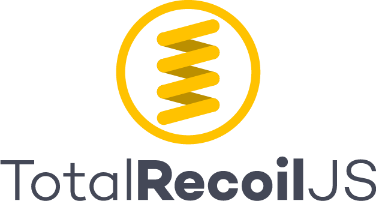

<!-- PROJECT SHIELDS -->
<!--
*** I'm using markdown "reference style" links for readability.
*** Reference links are enclosed in brackets [ ] instead of parentheses ( ).
*** See the bottom of this document for the declaration of the reference variables
*** for contributors-url, forks-url, etc. This is an optional, concise syntax you may use.
*** https://www.markdownguide.org/basic-syntax/#reference-style-links
-->
<!-- [![Contributors][contributors-shield]][contributors-url] -->
<!-- [![Stargazers][stars-shield]][stars-url]
[![LinkedIn][linkedin-shield]][linkedin-url] -->


<!-- PROJECT LOGO -->
<br />
<p align="center">
  <a href="https://github.com/oslabs-beta/TotalRecoilJS">
    
  </a>

  <!-- <h3 align="center">TotalRecoilJS</h3> -->

  <p align="center">
    A tool for Recoil developers
    <br />
    <a href="https://chrome.google.com/webstore/detail/recoil-dev-tools/dhjcdlmklldodggmleehadpjephfgflc"><strong>Download Chrome Extension»</strong></a>
    <br />
    <br />
    <a href="https://github.com/silvia-miranda/RecoilTravel">View Demo App (Recoil Application)</a>
    
  </p>
</p>


<!-- TABLE OF CONTENTS -->
## Table of Contents

* [About the Project](#about-the-project)
  * [Built With](#built-with)
* [Getting Started](#getting-started)
  * [Prerequisites](#prerequisites)
  * [Installation](#installation)
* [Usage](#usage)
* [License](#license)
* [Authors](#authors)
* [Acknowledgements](#acknowledgements)


<!-- ABOUT THE PROJECT -->
## About The Project

Total RecoilJS is a tool created to help developers visualize and track their Recoil state via a Chrome extension.


### Built With

* [React](https://reactjs.org/)
* [D3](https://d3js.org/)
* [TypeScript](https://www.typescriptlang.org/)
* [Chrome DevTools](https://developers.google.com/web/tools/chrome-devtools)


<!-- GETTING STARTED -->
## Getting Started

To get a local copy up and running, follow these simple steps.

### Prerequisites

Install React DevTools
```sh
https://chrome.google.com/webstore/detail/react-developer-tools/
```

### Installation
 
1. Clone the TotalRecoilJS github
```sh
git clone https://github.com/oslabs-beta/TotalRecoilJS.git
```
2. Install NPM packages
```sh
npm install
```
3. Start development server
```sh
npm run dev
```
4. Unpack to Google Chrome Extensions 

5. Navigate to Extensions -> Load Unpacked -> Select Total-Recoil/build/extension


<!-- USAGE EXAMPLES -->
## Usage


Visualize your component tree and see which components are subscribed to which atoms. When you click on an atom’s name, all components that are subscribed to that piece of state will light up.

Troubleshoot by seeing the current state held in each atom. 


<insert gif of atom state>

View list of previous states to track changes. 
On the history tab, you can see up to 10 previous state snapshots.


<insert gif of history>

 View all selector-atom subscriptions using our interactive sunburst and click on any selector to see all subscribed atoms.

<insert gif of sunburst image>
  
  


<!-- CONTRIBUTING -->
## Contributing

Contributions are what make the open source community such an amazing place to be learn, inspire, and create. Any contributions you make are **greatly appreciated**.


<!-- LICENSE -->
## License

Distributed under the MIT License. See `LICENSE` for more information.


<!-- CONTACT -->
## Authors

<strong>Anthony Lee - [@linkedIn](https://www.linkedin.com/in/anthony-lee27/) - [@GitHub](https://github.com/anthonylee2797)

<strong>Khizar Rehman - [@linkedIn](https://www.linkedin.com/in/khizar-rehman-a125711b4/) - [@GitHub](https://github.com/keyz-man)

<strong>Silvia Miranda - [@linkedIn](https://www.linkedin.com/in/silviakempmiranda/) - [@GitHub](https://github.com/silvia-miranda)

<strong>Zi Hao He - [@linkedIn](https://www.linkedin.com/in/zi-hao-he/) - [@GitHub](https://github.com/exquizzle)

<strong>Kevin Ruan - [@linkedIn](https://www.linkedin.com/in/kevin-ruan-7799711b1/) - [@GitHub](https://github.com/kevinr108)


<!-- ACKNOWLEDGEMENTS -->
## Acknowledgements

Denys Dekhtiarenko - [@linkedIn](https://www.linkedin.com/in/denysdekhtiarenko/) - [@GitHub](https://github.com/denskarlet)


<!-- MARKDOWN LINKS & IMAGES -->
<!-- https://www.markdownguide.org/basic-syntax/#reference-style-links -->
[contributors-shield]: https://github.com/oslabs-beta/TotalRecoilJS/graphs/contributors
[contributors-url]: https://github.com/oslabs-beta/TotalRecoilJS/graphs/contributors
[forks-shield]: https://img.shields.io/github/forks/othneildrew/Best-README-Template.svg?style=flat-square
[forks-url]: https://github.com/othneildrew/Best-README-Template/network/members
[stars-shield]: https://img.shields.io/github/stars/othneildrew/Best-README-Template.svg?style=flat-square
[stars-url]: https://github.com/oslabs-beta/TotalRecoilJS/stargazers
[issues-shield]: https://img.shields.io/github/issues/othneildrew/Best-README-Template.svg?style=flat-square

[license-url]: https://github.com/othneildrew/Best-README-Template/blob/master/LICENSE.txt
[linkedin-shield]: https://img.shields.io/badge/-LinkedIn-black.svg?style=flat-square&logo=linkedin&colorB=555
[linkedin-url]: https://linkedin.com/in/othneildrew
[product-screenshot]: images/screenshot.png
